# 🧠 MindWatch – YouTube Watch Time Tracker

MindWatch is a Chrome Extension that tracks and categorizes YouTube watch time to help users analyze their content consumption patterns.

It logs active watch time every 5 seconds and classifies videos into:

**Music | Entertainment | Knowledge | Other**

All data is stored locally using `chrome.storage` (privacy-friendly, no backend).

---
## 🛠 Tech Stack

| Layer        | Technology |
|-------------|------------|
| Platform    | Chrome Extension (Manifest V3) |
| Language    | JavaScript |
| Storage     | Chrome Storage API |
| UI          | HTML + CSS |

---
## 🏗 Project Architecture

```mermaid
graph TB

    A["🧠 MindWatch"]:::main

    subgraph *Core_Engine*
        B1["content.js"]
        B2["background.js"]
    end

    subgraph *User_Interface*
        C1["popup.html"]
        C2["popup.js"]
        C3["styles.css"]
    end

    subgraph *Configuration*
        D1["manifest.json"]
    end

    subgraph *Assets*
        E1["icons (16px • 48px • 128px)"]
    end

    A --> *Core_Engine*
    A --> *User_Interface*
    A --> *Configuration*
    A --> *Assets*

classDef main fill:#111,color:#fff,stroke:#fff,stroke-width:4px,font-weight:bold;

```

---
## 🔄 Currently Working On

- Improving classification accuracy  
- Weekly/monthly analytics  
- Visual charts  
- Smarter (ML-based) categorization  

---
## 🔥 Why MindWatch?

> Because,Every minute you spend watching matters.

---
